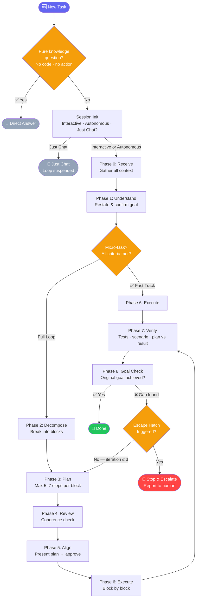

# 🤖 Claude Engineering Loop

A structured process for Claude Code — phases, planning, verification, escape hatches.

---

## The problem

If you let Claude Code run autonomously, it code-dumps without a clear goal, forgets its own context, and declares victory before verifying the results. You end up debugging AI-generated bugs instead of shipping features.

This is a drop-in `CLAUDE.md` template that defines a mandatory planning process, hard limits on retry loops, and an automatic escape hatch before Claude burns through your API credits.

---

## 🎯 What this does

A single `CLAUDE.md` file that defines a mandatory 9-phase process for every task:

```
Receive → Understand → Decompose → Plan → Align → Execute → Verify → [Gap? → Plan]
```

**Key behaviors it defines:**

- Agent confirms understanding with you before touching any code
- Every task is broken into blocks, each with an explicit plan
- Plans are reviewed for coherence before execution starts
- Execution is verified against the original goal — not just "it compiles"
- Infinite retry loops are cut off with a hard escape hatch
- Human confirmation gates can be disabled for fully autonomous runs

---

## 🗺️ How it works



---

## 🚀 Quick Start

```bash
curl -o CLAUDE.md https://raw.githubusercontent.com/sidan93/claude-eng-loop/main/CLAUDE.md
```

Review the file, fill in the `## Project Context` section, then launch Claude Code and give it a task. It will ask how to proceed before touching anything.

---

## 💬 Direct Answer for pure questions

Asking about a concept, tool, or technology — not this project? The agent answers immediately, no phases, no tracking:

- "What is prompt caching?" → Direct Answer
- "How does git rebase work?" → Direct Answer
- "How should we handle this in our codebase?" → Loop (has an action implication)
- "Why is this code slow?" → Loop (debugging task)

The check is strict: if the question references the project, contains any action word (fix, add, check, review…), or could produce a follow-up task — the Loop runs as usual.

---

## ⚡ Fast Track for micro-tasks

Fixing a typo? Renaming a variable? The agent detects micro-tasks and skips heavy planning:

```
Receive → Understand → Execute → Verify
```

Criteria: single self-contained change, no architectural decisions, no ambiguity, under 5 minutes. Everything else gets the full loop.

---

## 🔧 Execution modes

At the start of each task, the agent asks once (with clickable options if your environment supports it):

| Mode | When to use | What happens |
|------|------------|-------------|
| **Interactive** (default) | Unclear requirements, high stakes | Agent confirms understanding and plan before each key step |
| **Autonomous** | Well-defined task, you want to step away | Agent proceeds without approvals, stops only on hard blockers |
| **Just Chat** | Questions, exploration, brainstorming | Loop suspended — agent answers directly, no phases or planning |

**Two independent settings for fully autonomous runs:**
- **CLAUDE.md Autonomous mode** (chosen at session start) — controls whether the agent waits for approval at phase gates
- **Claude Code Auto mode** (`Shift+Tab` to cycle) — controls whether Claude prompts for permission on each file edit or shell command

Both can be set independently. Autonomous mode without Auto mode still prompts on each file/shell action. Auto mode without Autonomous mode still pauses at phase gates.

> **Security:** Claude Code Auto mode lets Claude act without per-action confirmation. Use only in isolated environments — never with access to production systems or credentials.

---

## 🛡️ Escape hatch

The loop never runs forever. Claude stops and asks you when:

- The same gap appears twice across iterations
- A block fails more than twice
- The root cause is outside Claude's control (third-party bug, missing access, changed requirements)
- More than 3 full loop iterations complete without reaching the goal

---

## 📋 The 9 phases

| Phase | What happens |
|-----------------|-------------|
| 0 — Receive | Read the full task and all linked context before forming any opinion |
| 1 — Understand | Restate the task; confirm with you (interactive) or document and proceed (autonomous) |
| 2 — Decompose | Break into independently plannable blocks |
| 3 — Plan | Write an explicit step-by-step plan for each block (max 5–7 steps) |
| 4 — Review | Read all plans together, check coherence against the original goal |
| 5 — Align | Summary for simple tasks; full plans for complex ones; wait for approval or proceed per mode |
| 6 — Execute | Run block by block using available tools and skills |
| 7 — Verify | Tests, core scenario, plan vs. result — mandatory before declaring done |
| 8 — Goal check | Did we achieve what was actually asked? If not — gap analysis, back to Phase 3 |

---

## 💰 Token usage

The goal isn't to save tokens — it's to actually achieve what you asked for. Without structure, Claude produces output. With the loop, Claude produces the right output.

Catching a wrong approach in Phase 3 is cheaper than unwinding it after Phase 6.

- **Interactive mode** is cost-efficient — you review plans before the model executes, so errors are caught early
- **Autonomous mode** can be expensive on large or ambiguous tasks — iterative gap analysis multiplies context fast. Use it on tightly scoped tasks. Set a budget limit in Claude Code settings before running autonomously
- **Plan verbosity** is capped at 5–7 steps per block by default

---

## 📦 Setup options

**Per-project (recommended):** drop `CLAUDE.md` into your repo root and fill in `## Project Context`. Pay special attention to **Off-limits** — this is what prevents Claude from touching production databases, force-pushing main, or doing anything irreversible without review.

**Global (all projects):** place `CLAUDE.md` in `~/.claude/` and remove the `## Project Context` section — it has no meaning at the global level.

| Scope | Location | Project Context |
|-------|----------|----------------|
| Global | `~/.claude/CLAUDE.md` | Remove it |
| Per-project | `<repo-root>/CLAUDE.md` | Fill it in |

Both can coexist: global sets the process, per-project overrides with specifics. Claude Code loads global config first, project config second — later instructions win for the same topic.

**Existing CLAUDE.md:** paste the Engineering Loop content before or after your existing instructions. Project-specific instructions take priority over the loop.

---

## 🛠️ Works with

- **Bare Claude Code** — no extra setup required
- **MCP servers** (Jira, GitLab, Figma, Confluence, etc.) — the loop tells the agent when and how to use them
- **Superpowers plugin** — skill references map directly to Superpowers skills; without it, they describe the approach to take manually

---

## ⚠️ Probabilistic, not deterministic

The Engineering Loop is a process guide, not an enforcement system. LLMs follow instructions reliably in most cases — but a capable model with extended thinking can rationalize skipping phases when a task looks "obvious". The model reads the instructions, understands them, and still decides they don't apply right now.

This is a known property of instruction-following in LLMs, not a bug in the template.

**To maximize compliance:**

- **Mention the loop explicitly in your prompt.** "Follow the Engineering Loop" or "start with the mode question" in the task message significantly improves compliance — the instruction is fresh in context when the model starts reasoning.
- **Interrupt when phases are skipped.** If the agent jumps straight to coding, stop it: "You're skipping the loop — go back to Phase 0." Self-correction works well once the model is reminded.
- **Fresh sessions help.** A model mid-session with lots of context is more likely to shortcut. Start a new session for significant tasks.
- **Avoid conflicting plugins.** Any plugin that instructs the model to "act immediately before any response" competes with the mode question. The loop works best without aggressive system-level plugins.

The loop works as a shared contract between you and the agent. When both sides reference it, compliance is high. When only the file does, it's probabilistic.

---

## 🔍 How to verify the loop is working

Claude should name the current phase at each transition. If it silently jumps to writing code — it's not following the loop.

**Signs it's working:**
- First message asks "Interactive, Autonomous, or Just Chat?"
- Responses mention phases: "Phase 0: reading the ticket...", "Phase 3: writing plans..."
- Micro-tasks get: `"Fast Track: [reason]. Skipping Phases 2–5."`
- In Just Chat mode: no phases mentioned — that's correct, not broken

**Signs it's not:** starts coding immediately without asking the mode question, never mentions phases in Interactive/Autonomous, declares done without verifying.

**If it skips phases:** this is expected occasionally — see the Probabilistic section above. Interrupt and redirect: "Stop. You skipped the loop. Ask me for mode and restart from Phase 0." The model knows the rules and self-corrects well when prompted directly.

---

## ✏️ Customization

The loop is intentionally generic. Extend it in your `CLAUDE.md`:

- Add project-specific steps per phase (`"in Phase 6, always run make lint before committing"`)
- Override parallelism rules for your stack
- Add domain-specific escape hatch conditions
- Replace generic skill references with concrete tool names

---

## License

MIT
